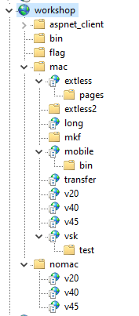

# Viewstate Security Workshop

This repository is for the **Testing ASP.NET ViewState with YSoNet (YSOSerial.NET)** workshop.

**Recommended Reading:** [Exploiting Deserialisation in ASP.NET via ViewState](https://soroush.me/blog/exploiting-deserialisation-in-asp-net-via-viewstate)

## Security Warning

**This is an intentionally insecure lab environment for security testing and educational purposes only.**

- The server uses publicly disclosed machine keys, making it vulnerable to ViewState deserialization attacks
- **DO NOT** deploy this application on any publicly accessible network
- **ALWAYS** run this lab in an isolated environment (VM, container, or air-gapped network)
- The vulnerabilities in this lab can lead to Remote Code Execution (RCE) if exploited

This lab is designed to help security professionals improve their testing capabilities for ASP.NET ViewState vulnerabilities. Use responsibly and only in controlled environments.

## Setup Steps

Run these steps on your isolated Windows Server to prepare the lab environment. Open an **elevated PowerShell terminal** (Run as Administrator) and execute the following commands:

### Step 1: Download the Repository

```powershell
# Clone the repository (or download and extract the ZIP)
git clone https://github.com/irsdl/viewstate-security-workshop.git
cd viewstate-security-workshop
```

### Step 2: Install IIS and .NET Framework

```powershell
.\tools\Install-IISAndDotNet.ps1
```

This installs IIS with ASP.NET support and all required .NET Framework versions.

### Step 3: Disable Windows Defender

```powershell
.\tools\Disable-DefenderProtection.ps1
```

**Why disable Defender?** For this lab, we disable Windows Defender so that command execution via ViewState exploits is not blocked. This allows you to clearly observe successful exploitation without interference from endpoint protection.

**Important:** In a real-world testing lab or production environment, you should keep protections enabled. The goal of this workshop is to understand the vulnerability mechanics—once you've learned the techniques, practice detecting and blocking these attacks with Defender enabled.

### Step 4: Import the Workshop IIS Site

```powershell
.\import-workshopiis.ps1
```

This interactive script sets up the vulnerable workshop site in IIS. It will prompt for configuration options with the following defaults:

| Setting | Default Value |
|---------|---------------|
| Config file | `.\workshop-iis-config.json` |
| Site name | `workshop` |
| Root path | `C:\workshop\websites\wwwdata` |
| HTTP port | `80` |

The script will:
- Copy the `content` folder to the site root path
- Create the required application pools
- Configure the IIS site with multiple vulnerable applications (mac/nomac variants for different .NET versions)

After setup, your IIS Manager should look like this:




------
Only for curious readers:

## Tools

### Install-IISAndDotNet.ps1

Prepares a Windows Server for the lab by installing IIS and .NET Framework components.

**Location:** `tools/Install-IISAndDotNet.ps1`

**Usage:**
```powershell
# Run as Administrator
.\tools\Install-IISAndDotNet.ps1
```

**What it installs:**
- IIS Web Server with management tools
- Common HTTP features (default documents, directory browsing, static content)
- Application Development features (ASP.NET 3.5, ASP.NET 4.5+, ISAPI extensions/filters)
- .NET Framework 3.5 (includes 2.0 and 3.0)
- .NET Framework 4.5/4.8 features
- Security components (request filtering, basic/Windows authentication)
- WCF Services (optional)

**Note:** For .NET Framework 3.5 installation on isolated servers, you may need to mount a Windows Server ISO and uncomment the source-based installation option in the script.

### Disable-DefenderProtection.ps1

Disables Windows Defender protections to allow exploitation tools to run in the lab environment.

**Location:** `tools/Disable-DefenderProtection.ps1`

**Usage:**
```powershell
# Run as Administrator
.\tools\Disable-DefenderProtection.ps1
```

**What it disables:**
- Real-time antivirus monitoring
- AMSI/script scanning
- Web/download scanning (IOAV protection)
- Behavior monitoring
- Cloud "first seen" blocking

### Enable-DefenderProtection.ps1

Re-enables Windows Defender protections after lab use.

**Location:** `tools/Enable-DefenderProtection.ps1`

**Usage:**
```powershell
# Run as Administrator
.\tools\Enable-DefenderProtection.ps1
```

**What it enables:**
- Real-time antivirus monitoring
- AMSI/script scanning
- Web/download scanning (IOAV protection)
- Behavior monitoring
- Cloud "first seen" blocking

### import-workshopiis.ps1

Interactive script that imports the workshop IIS site configuration and deploys the vulnerable web content.

**Location:** `import-workshopiis.ps1`

**Usage:**
```powershell
# Run as Administrator
.\import-workshopiis.ps1
```

**What it does:**
- Prompts for site name, root path, and HTTP port (with sensible defaults)
- Copies the `content` folder to the specified root path
- Creates required application pools (including `.NET v2.0` pool for legacy apps)
- Creates the IIS site with configured bindings
- Sets up child applications for various ViewState test scenarios

### workshop-iis-config.json

JSON configuration file that defines the IIS site structure exported from a reference lab server.

**Location:** `workshop-iis-config.json`

**Contains:**
- Site bindings (HTTP port 80, HTTPS port 443)
- Application pool assignments
- Child application paths for different test scenarios:
  - `/mac/*` - Applications with MAC validation enabled
  - `/nomac/*` - Applications without MAC validation
  - Version-specific apps (`v20`, `v40`, `v45`) for testing different .NET runtimes

## Disclaimer

This software has been created purely for the purposes of academic research and for the development of effective defensive techniques, and is not intended to be used to attack systems except where explicitly authorized. Project maintainers are not responsible or liable for misuse of the software. Use responsibly.

This software is a personal project and not related to any companies, including the project owner's and contributors' employers.
